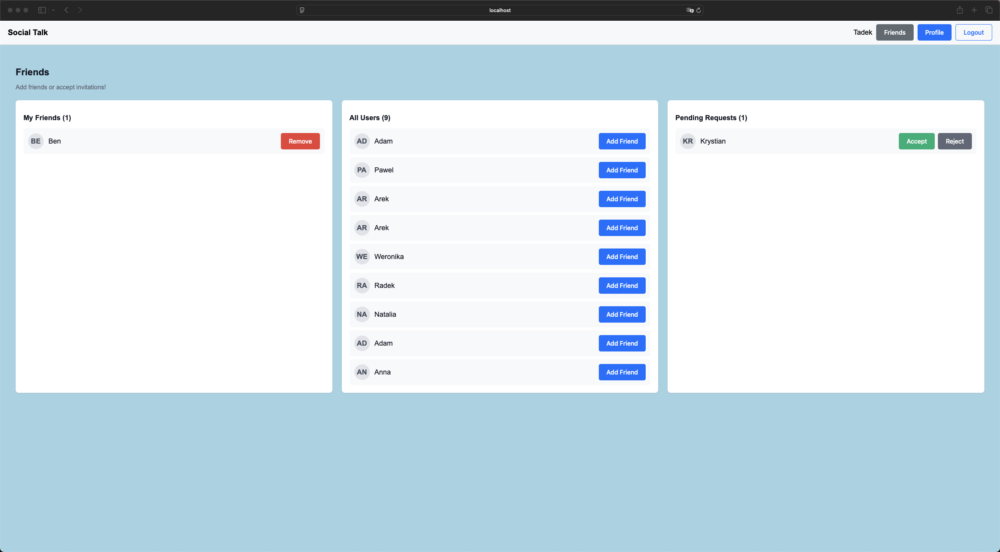

# Social Talk frontend documentation

## Introduction

Documentation provides a detailed overview of the fronted interface for the application. It has been written by using
technologies:

* React - core library for building the user interface
* TypeScript - for adding static typing and improving code quality
* Vite - fast build tool and development server for modern frontend projects
* React Router DOM - for routing and navigation within the application
* Axios - for handling HTTP requests to interact with APIs
* React Hook Form - for managing forms and form validation
* STOMP.js and SockJS Client - for WebSocket communication, often used in real-time features
* JS-Cookie - for managing cookies, such as storing authentication tokens
* JWT-Decode - for decoding and managing JSON Web Tokens (JWT)
* ESLint - for linting and ensuring code quality
* Prettier - for consistent code formatting
* @vitejs/plugin-react - enhances Vite's support for React projects

### Home page for unregistered/logged-out users

The default home page displayed for users who are not logged in, showcasing general app features:

### Registration panel

The registration panel allows new users to create an account by entering username, email address and password:

### Login panel

The login panel enables existing users to sign in with their registered credentials:

### Home page for logged in user

The default home page displayed for users who are logged in, showcasing all app features:

### User profile

The user profile displays account details:

## Friends manager:

### No friends

This view indicates that the user has not added any friends yet and may include an option to add friends:

### With friends

This section shows that the user has added friends and may include an option to add other friends:

# Chat:

### View of the person who wrote the first message

This is the initial chat view for a conversation in which no messages have been exchanged yet:

### View from the conversation between friends:

This view shows a chat with the user's friend, displaying their messages and the chat interface:

